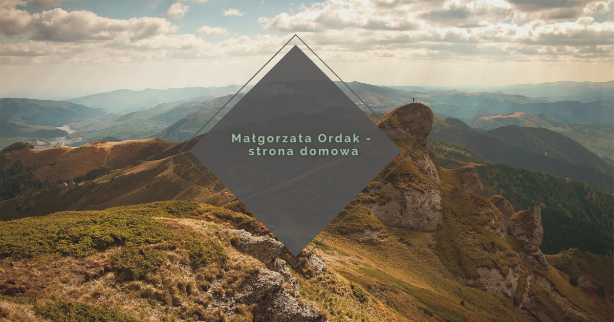

# Homepage Małgosi

Moja strona domowa. Tu się dzieją różne dziwne i tajemnicze rzeczy 😉. Powstawała w ramach mojego pierwszego projektu, była zatem takim moim *królikiem doświadczalnym*. Edytowałam ją wielokrotnie, testowałam różne rozwiązania i sprawdzałam w praktyce wiedzę zdobytą podczas kursu ***WTF Co ten frontend***.   

## Co tu można znaleźć?

Na stronie można przeczytać kilka słów o tym kim jestem, skąd się tu wzięłam, co lubię robić. Jest tu również sekcja z listą moich repozytoriów.

Zapraszam  🙂

